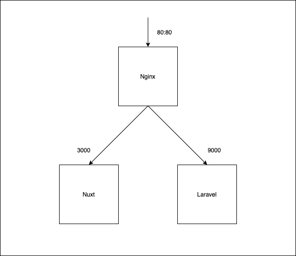

## 概要

Nuxt + Laravel(Lumen)の開発環境構築テンプレートです。

### 関係図



## 開発環境立ち上げ

```
$ docker-compose up
```

## Frontend

下記のコマンドで Nuxt プロジェクトを作成します。
./frontend というディレクトリに Nuxt プロジェクトが一式準備されます。

### 1. プロジェクトの作成

空じゃないディレクトリに対して強制的に create-nuxt-app 使いたい時は--overwrite-dir つけて実行

```
$  docker-compose exec web yarn create nuxt-app ./  --overwrite-dir
```

### 2. 監視

下記コマンドで常時ビルドするようにします。

```
$ docker-compose exec web yarn dev
```

下記 URL で Nuxt.js のデフォルトの画面が表示されるか確認する。

[http://localhost/](http://localhost)

## Backend

下記のコマンドで Lumen プロジェクトを作成します。
※ Laravel もほぼ同じなので省略します。

### 1. 仮プロジェクトの作成

※ 直下はファイルが存在しているため不可能

```
$ docker-compose exec api composer create-project laravel/laravel blog
```

### 2. 作成した仮プロジェクトを直下にコピー

cp コマンド

オプション f:

_宛先ファイルを開くことができない場合は、アクセス許可に関係なく確認を求めずに、ファイルを削除して新しいファイルを作成します。_

オプション R:

_source_file がディレクトリを指定している場合、cp はその時点で接続されているディレクトリとサブツリー全体をコピーします。 source_file が/で終わる場合、ディレクトリの内容はコピーされません。
ディレクトリ自体。このオプションを使用すると、シンボリックリンクが間接的にではなくコピーされ、cp が通常のファイルとしてコピーするのではなく特別なファイルを作成するようになります。作成した
ディレクトリは、対応するソースディレクトリと同じモードであり、プロセスの umask によって変更されません。_

```
$ docker-compose exec api cp -fR ./blog/. ./
```

### 3. 仮プロジェクトを削除

```
$ docker-compose exec api rm -rf ./blog
```

### 4. コンテナに入る

起動しているコンテナに対してコマンド実行を行うには、この操作が必要。

Docker exec コマンドは簡単に表現すると、『対象のコンテナで、対象のコマンドを実行する』もの。

[参考:【Docker-Compose】コンテナ起動から入るまでを丁寧に](https://www.nyamucoro.com/entry/2018/01/11/224932)

今回はコンテナの中に入りたい。つまり、中で LINUX 操作を行える必要があります。

そのために、Bash を起動するとします

```
$ docker-compose exec #{container} ${command}
# (例)
$ docker-compose exec #{container} bash
# (もっと詳しく)
$ docker-compose exec api ash
```

### 5. DB サーバーにログイン

```bash
# 起動したコンテナにログイン
$ docker-compose exec db bash

# MySQLを起動
$ mysql -u root -p -h 127.0.0.1

# この後パスワードを入力して完了
> password
 
> CREATE DATABASE DB名 DEFAULT CHARACTER SET utf8mb4;
> CREATE USER 'ユーザー名'@'localhost'  IDENTIFIED WITH mysql_native_password BY 'パスワード';
> GRANT ALL PRIVILEGES ON DB名.* TO 'ユーザー名'@'localhost';

>create user 'ユーザー名'@'%' identified by '好きなパスワード';
create user 'kouhei'@'%' identified by 'kamv890v';

> CREATE DATABASE DB名 DEFAULT CHARACTER SET utf8mb4;
CREATE DATABASE lp_dashboard DEFAULT CHARACTER SET utf8mb4;

> use DB名;use lp_dashboard;
use lp_dashboard;

>GRANT ALL PRIVILEGES ON DB名.* TO 'ユーザー名'@'localhost';
GRANT ALL PRIVILEGES ON lp_dashboard.* TO 'kouhei'@'localhost';
GRANT ALL PRIVILEGES ON lp_dashboard.* TO 'kouhei'@'%';

> FLUSH PRIVILEGES;

>SELECT user, host, db FROM mysql.db;
# kouhei, %, lp_dashboard ならOK
+---------------+-----------+--------------------+
| user          | host      | db                 |
+---------------+-----------+--------------------+
| kouhei        | %         | lp_dashboard       |
| mysql.session | localhost | performance_schema |
| mysql.sys     | localhost | sys                |
+---------------+-----------+--------------------+

```
[DockerのMySQL接続で「SQLSTATE[HY000] [1045] Access denied for user」が出たときの対処法](https://qiita.com/akki-memo/items/357c1547a465af1c79d6)

### 6. Laravel 側の設定

1. .env ファイルを docker-compose の mysql の内容で書き換える

```.env
DB_CONNECTION=mysql
DB_HOST=db # コンテナの名前
DB_PORT=3306
DB_DATABASE=dev
DB_USERNAME=dev
DB_PASSWORD=password
```

2. コンテナを再起動させて設定したDBを認識させる
```bash
# volumeのキャッシュを削除
$ docker-compose down --volumes
# 起動
$ docker-compose up -d
# Laravel(api)コンテナの中に入る
$ docker-compose exec api ash
# キャッシュをクリア
$ php artisan config:cache
# migrate実行
$ php artisan migrate

```

2. migrate の実行

```bash
$ php artisan migrate
```

3. もし　 php artisan migrate でエラーが出る場合

```bash
# 直接実行
$  docker-php-ext-install pdo_mysql
```

### 7. migrate がうまくいった後、サーバーサイドの URL を開いてみる

下記コードを route/web.php に記入する。

Nginx 側で _/api_ で Laravel をみるように設定したので、必ず api/と書く

```phpt
Route::get('api/', function () {
    return response()->json(['apple' => 'red', 'peach' => 'pink']);
//    return view('welcome');
});
```

下記エンドポイントにアクセスして表示の確認

[http://localhost/api]([http://localhost/api])

### 8. 再ビルド

```bash
# キャッシュを含めることなくimageをbuildする
$ docker build --no-cache .Dockerfileがあるパス
# (例)
$ docker build --no-cache ./.docker/nginx
# Volumeのキャッシュも削除
$ docker-compose down --volumes

# この後パスワードを入力して完了
```

### 9. 参考

[【Docker-Compose】コンテナ起動から入るまでを丁寧に](https://qiita.com/tsuboyataiki/items/90dbe94553d3dea39b19)

[Docker コンテナの作成、起動〜停止まで](https://qiita.com/kooohei/items/0e788a2ce8c30f9dba53)

[docker-compose を利用して同一リポジトリで Nuxt(web) + Laravel(API)な開発環境を準備する](https://qiita.com/nagi125/items/09ddbbfa923c0999494e)

[DockerのMySQL接続で「SQLSTATE[HY000] [1045] Access denied for user」が出たときの対処法](https://qiita.com/akki-memo/items/357c1547a465af1c79d6)

